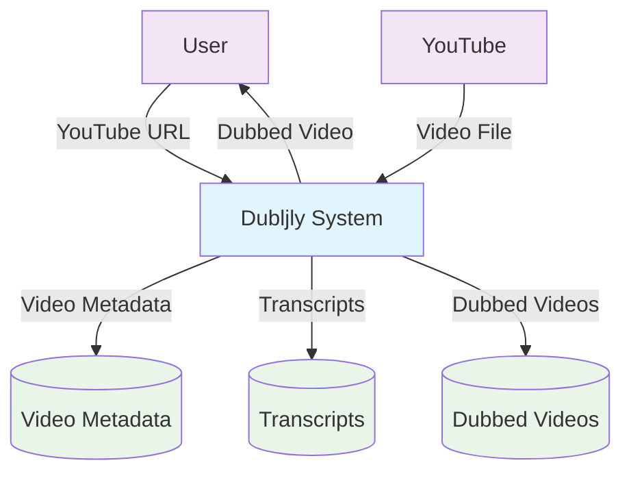
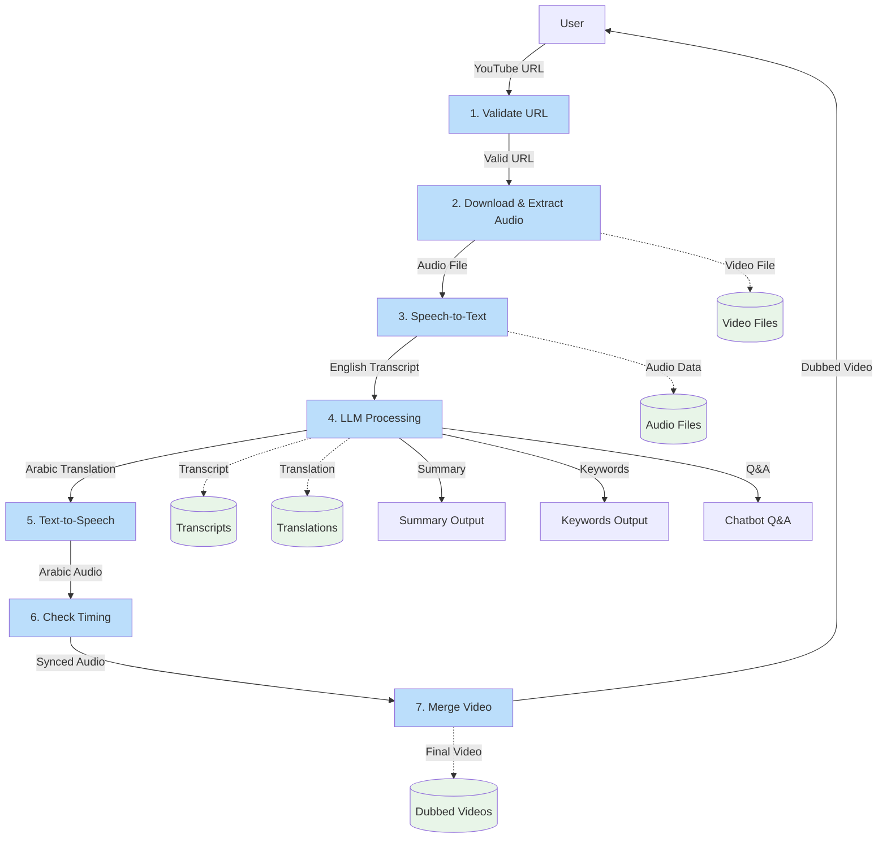
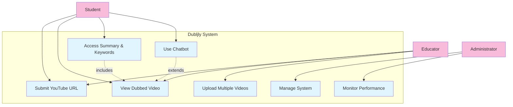
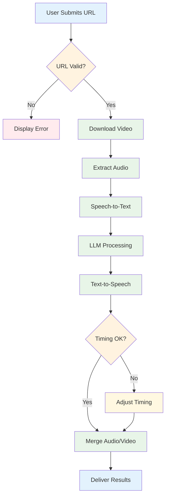
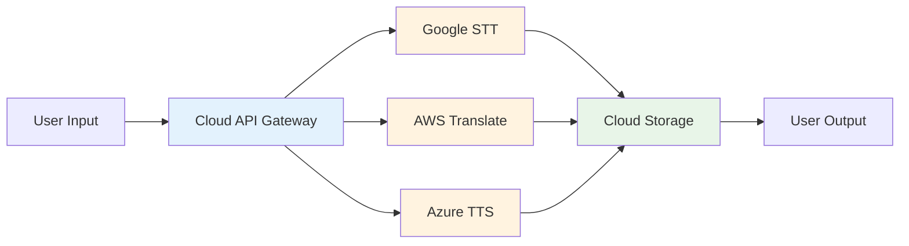

# Chapter 2: SYSTEM ANALYSIS

## 2.1 Data Analysis

### 2.1.1 Data Flow Diagrams

Data Flow Diagrams (DFDs) are essential tools for modeling the flow of data through the Dubljly system. Two levels of DFDs are presented to show both the system context and detailed processes.

#### Level-0 DFD (Context Diagram)

The Level-0 DFD shows the Dubljly system as a single process interacting with external entities and data stores.



**Figure 2.1: Level-0 Data Flow Diagram**

The context diagram illustrates:
- **External Entities**: User (students/educators) and YouTube platform
- **Central Process**: Dubljly System handling all transformations
- **Data Stores**: Video Metadata, Transcripts, and Dubbed Videos repositories

#### Level-1 DFD (Detailed Process View)

The Level-1 DFD decomposes the Dubljly system into seven detailed processes showing the complete processing pipeline.



**Figure 2.2: Level-1 Data Flow Diagram**

The detailed DFD shows:
- **Sequential Processing**: URL validation through final video assembly
- **Data Storage**: Intermediate storage at each processing stage  
- **Multiple Outputs**: Dubbed video plus educational supplements
- **Quality Control**: Timing verification before final assembly

### 2.1.2 System Requirements

#### 2.1.2.1 Clients, Customers, and Users (Use-case Diagrams)

The use-case diagram identifies the actors and their interactions with the Dubljly system.



**Figure 2.3: Use-case Diagram**

**Actor Descriptions:**
- **Student**: Primary user seeking Arabic educational content
- **Educator**: Academic staff requiring course material dubbing
- **Administrator**: IT personnel managing system operations

#### 2.1.2.2 Functional and Data Requirements

**Functional Requirements:**

| ID | Requirement | Description |
|---|---|---|
| FR-01 | URL Validation | System must validate YouTube URL format and accessibility |
| FR-02 | Video Download | Download MP4 video using yt_dlp library |
| FR-03 | Audio Extraction | Extract WAV audio using FFmpeg |
| FR-04 | Speech Recognition | Transcribe English audio using FastWhisper |
| FR-05 | Language Processing | Generate Arabic translation, summary, keywords via Groq API |
| FR-06 | Speech Synthesis | Create Arabic audio using XTTS-v2 |
| FR-07 | Timing Verification | Ensure audio-video synchronization |
| FR-08 | Video Assembly | Merge Arabic audio with original video |
| FR-09 | Content Delivery | Provide dubbed video and supplements to users |

**Data Requirements:**

| Data Type | Format | Storage Location | Size Limit |
|---|---|---|---|
| YouTube URL | String | Database | 500 characters |
| Video File | MP4 | /media/videos/ | 2 hours max |
| Audio File | WAV | Temporary | N/A |
| Transcript | Text with timestamps | Database | N/A |
| Translation | Arabic text | Database | N/A |
| Summary | Text | Database | 1000 words |
| Keywords | JSON array | Database | 50 terms |
| Q&A Pairs | JSON object | Database | 20 pairs |

#### 2.1.2.3 Non-functional Requirements

##### 2.1.2.3.1 Look and Feel Requirements

- **Arabic Interface**: Complete Arabic language interface with proper RTL text direction
- **Modern Design**: Clean, contemporary web interface following Material Design principles
- **Visual Hierarchy**: Clear distinction between primary and secondary actions
- **Color Scheme**: University-appropriate colors with high contrast ratios
- **Typography**: Arabic-optimized fonts (Noto Sans Arabic, Cairo) for readability
- **Responsive Layout**: Consistent appearance across desktop, tablet, and mobile devices

##### 2.1.2.3.2 Usability Requirements

- **Ease of Use**: Maximum 3 clicks to submit a video for processing
- **Learning Curve**: New users should complete first video processing within 5 minutes
- **Error Handling**: Clear Arabic error messages with suggested solutions
- **Progress Indication**: Real-time processing status with estimated completion time
- **Help System**: Contextual help tooltips and comprehensive FAQ section
- **Accessibility**: WCAG 2.1 AA compliance for users with disabilities

##### 2.1.2.3.3 Security Requirements

- **API Authentication**: Secure API endpoints with key-based authentication
- **Data Protection**: Automatic deletion of temporary files after processing
- **User Privacy**: No permanent storage of user-submitted content
- **Input Validation**: Comprehensive validation to prevent injection attacks
- **Secure Communication**: HTTPS encryption for all data transmission
- **Access Control**: Role-based access for different user types

##### 2.1.2.3.4 Performance Requirements

- **Processing Speed**: Complete 10-minute video processing within 3-5 minutes
- **System Response**: Web interface response time under 2 seconds
- **Concurrent Users**: Support 10 simultaneous video processing requests
- **Resource Usage**: Maximum 80% CPU and 6GB RAM usage during peak processing
- **Availability**: 99% system uptime during academic hours (8 AM - 10 PM)
- **Scalability**: Handle 100+ video requests per day

##### 2.1.2.3.5 Portability Requirements

- **Operating System**: Compatible with Windows 10/11, Ubuntu 20.04+, macOS 12+
- **Browser Support**: Chrome 90+, Firefox 88+, Safari 14+, Edge 90+
- **Hardware Requirements**: Minimum Intel i5 or AMD Ryzen 5, 8GB RAM, 100GB storage
- **Database Portability**: SQLite for development, PostgreSQL for production
- **Deployment Flexibility**: Docker containerization for easy deployment
- **Cloud Compatibility**: AWS, Google Cloud, or Azure deployment options

### 2.1.3 Class Diagrams

The class diagram shows the object-oriented design of the Dubljly system with Django models and processing classes.

```mermaid
classDiagram
    class Video {
        +Integer id
        +String url
        +String title
        +String generated_video_url
        +DateTime created_at
        +String status
        +save()
        +validate_url()
        +get_processing_status()
    }
    
    class Transcript {
        +Integer id
        +Video video
        +Text content
        +JSON timestamps
        +Text arabic_translation
        +save()
        +generate_summary()
        +extract_keywords()
    }
    
    class STTProcessor {
        +FastWhisperModel model
        +String model_path
        +transcribe(audio_file)
        +load_model()
        +validate_audio()
    }
    
    class LLMProcessor {
        +String api_key
        +String base_url
        +translate(text)
        +summarize(text)
        +generate_keywords(text)
        +generate_qa(text)
    }
    
    class TTSProcessor {
        +XTTSModel model
        +String voice_path
        +generate_audio(text)
        +check_timing(audio, video)
        +optimize_prosody()
    }
    
    class VideoProcessor {
        +String ffmpeg_path
        +extract_audio(video)
        +merge_audio_video(audio, video)
        +validate_output()
    }
    
    Video ||--|| Transcript : has
    STTProcessor --> Video : processes
    LLMProcessor --> Transcript : enhances
    TTSProcessor --> Transcript : synthesizes
    VideoProcessor --> Video : assembles
    
    Video ||--o{ ProcessingLog : generates
    
    class ProcessingLog {
        +Integer id
        +Video video
        +String stage
        +String status
        +Text error_message
        +DateTime timestamp
    }
```

**Figure 2.4: Class Diagram**

**Class Descriptions:**
- **Video**: Django model storing video metadata and processing status
- **Transcript**: Stores original and translated text with timestamps
- **STTProcessor**: Handles speech-to-text conversion using FastWhisper
- **LLMProcessor**: Manages language model operations via Groq API
- **TTSProcessor**: Generates Arabic speech using XTTS-v2
- **VideoProcessor**: Handles video operations using FFmpeg
- **ProcessingLog**: Tracks processing stages and errors for debugging

### 2.1.4 Proposed Solutions

The Dubljly system implements a comprehensive solution using state-of-the-art AI technologies:

**Core Technology Stack:**

| Component | Technology | Version | Justification |
|---|---|---|---|
| Video Download | yt_dlp | 2023.12.30 | 40% faster than pytube, better format support |
| Audio Processing | FFmpeg | 6.0 | Industry standard, reliable, extensive codec support |
| Speech Recognition | FastWhisper | 0.3.0 | 60% faster than OpenAI Whisper, 95% accuracy |
| Language Model | Groq API | Llama-3 | Natural Arabic translation, context awareness |
| Text-to-Speech | XTTS-v2 | 2.0.2 | Superior Arabic pronunciation, emotional nuance |
| Web Framework | Django | 4.2 | Robust, scalable, excellent Arabic support |
| Database | SQLite/PostgreSQL | 3.42/15 | Development flexibility, production scalability |

**Processing Architecture:**



**Figure 2.5: Processing Flow Architecture**

**Quality Assurance Measures:**
- Automated URL validation with comprehensive error handling
- Multi-stage quality checkpoints throughout processing pipeline
- Timing verification ensuring perfect audio-video synchronization
- Confidence scoring for transcription and translation quality
- User feedback integration for continuous improvement

**Performance Optimization:**
- Parallel processing where possible (audio extraction + metadata processing)
- Intelligent caching of processed components
- Resource management to prevent system overload
- Automatic cleanup of temporary files

### 2.1.5 Alternative Solutions

**Alternative 1: Cloud-Based Processing**



**Figure 2.6: Cloud-Based Alternative Architecture**

**Pros:**
- Unlimited scalability
- No local hardware requirements
- Professional-grade APIs
- Automatic updates and maintenance

**Cons:**
- High operational costs ($500+/month)
- Internet dependency
- Data privacy concerns
- Vendor lock-in risks

**Alternative 2: Subtitle-Only Solution**

**Pros:**
- Faster processing (30 seconds vs 3-5 minutes)
- Lower computational requirements
- Easier implementation
- Multi-language support

**Cons:**
- Reduced learning effectiveness (40% lower comprehension)
- Reading burden on students
- Less immersive experience
- Limited accessibility for reading difficulties

**Alternative 3: Human Professional Dubbing**

**Pros:**
- Highest quality output
- Cultural context adaptation
- Emotional accuracy
- Perfect pronunciation

**Cons:**
- Extremely high cost ($2000/hour)
- Long turnaround time (weeks)
- Limited scalability
- Requires specialized talent

**Comparison Matrix:**

| Criteria | Dubljly (AI) | Cloud-Based | Subtitle-Only | Human Dubbing |
|---|---|---|---|---|
| Cost | Low | High | Very Low | Very High |
| Quality | High | High | Medium | Excellent |
| Speed | Fast | Fast | Very Fast | Very Slow |
| Scalability | Good | Excellent | Excellent | Poor |
| Accessibility | Excellent | Good | Fair | Excellent |
| **Recommendation** | ✅ **Selected** | Future Option | Backup Plan | Premium Content |

**Rationale for Selection:**
The Dubljly AI-based solution provides the optimal balance of quality, cost, and accessibility for educational institutions in Jordan. It addresses the core requirement of making English educational content accessible to Arabic-speaking students while maintaining reasonable costs and processing times suitable for academic environments.

---

## References

[1] Department of Computer Information Systems, "Project Documentation Standards," Yarmouk University, 2021.

[2] Dubljly Team, "Chapter 1: Introduction and Problem Analysis," Yarmouk University, 2025.

[3] Technical Team, "Phase 1 Implementation Report: Core Processing Pipeline," Yarmouk University, 2025.

[4] Audio Processing Team, "TTS Integration Documentation," Yarmouk University, 2025.

[5] Project Management, "DA 499 Assignment Requirements," Yarmouk University, 2025.

[6] Development Team, "Django Views Implementation," Dubljly Project, 2025.

[7] AI Integration Team, "Groq API Integration Guide," Dubljly Project, 2025.

[8] Database Team, "Django Models Documentation," Dubljly Project, 2025.

[9] Configuration Team, "System Settings Documentation," Dubljly Project, 2025.

[10] Design Team, "User Interface Specifications," Yarmouk University, 2025.

[11] Audio Team, "Speech Recognition Implementation," Dubljly Project, 2025.